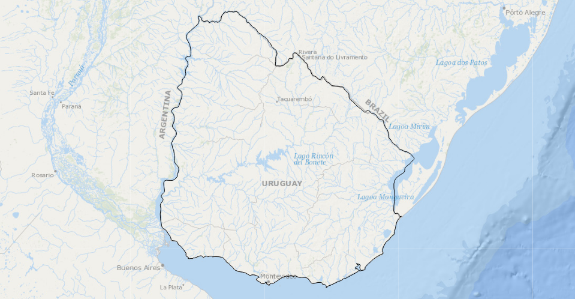

# d3-slippy

*Experimental at this point. Structure likely to change*

The goal of `d3-slippy` is to minimize the interface with tile services and tile coordinates while making D3 maps. It achieves this goal by relying on a Mercator projection to place the tiles, allowing use of geographic coordinates throughout. In a sense `d3-slippy` is a modified generic D3 Mercator projection.

<a href="https://bl.ocks.org/Andrew-Reid/3b1fb5ce8957dab2e3f5042931dddf6c"></a>


## General

### d3.slippy()

Returns a new slippy map projection.

### slippy.width(*width*) / slippy.height(*height*)

If width or height are provided, sets the width/height of the map. Unlike a typical D3 projection this is required to know how many tiles to display. If no argument is provided, returns the current width/height. Default height is 500 while default width is 960.

### slippy.size(*[width,height] or selection*)

A convenience method that sets both size and width. If the provided argument is a D3 selection, will set the dimensions of the map to match the dimensions of the selected element (most commonly used for the SVG holding the map). If the provided argument is not a D3 selection, d3-slippy assumes an array has been provided indicating width and height of the map respectively.

If no argument is provided, returns the current dimensions of the map.

### slippy.wrap(*wrap*)

Takes a true / false boolean value to determine if the tiles should be wrapped. Default is false.

### slippy.source(*source*)

Takes a geographical tile source in the form of a function, where the function returns a tile's address given x,y and z coordinates. For example:

```
function(d) {
   return "https://cartodb-basemaps-b.global.ssl.fastly.net/light_all/"+d.z+"/"+d.x+"/"+d.y+".png";
}
```
      
If no argument is provided, returns the current source.
      
### slippy.attribution(*attribution*)

Can be provided an attribution line, more commonly used to return the attribution string when a tile set is provided using the `slippy.tileSet()` method.

### slippy.xyz(*true/false*)

If provided false, the tiles will be assumed to be of a TMS layout scheme (such as those tiles produced by TileMill). If true (the default), the tiling will be xyz (most tile sources). By default this is set to true.

### slippy.tileSet(*tileSet*)

If provided, sets the tile set to be used. Some tile sets modify the projection (Arctic polar tiles for example) and slippy properties.

Tile sets can be from one of the built in tile sources and attributions. This method takes one of the names of those tile sources and sets the appropriate tile source and attribution. Valid values are:

* `CartoDB_Positron`

</img>

* `CartoDB_PositronNoLabels`
* `CartoDB_PositronOnlyLabels`
* `CartoDB_DarkMatter`
* `CartoDB_DarkMatterNoLabels`
* `CartoDB_DarkMatterOnlyLabels`
* `CartoDB_Voyager`
* `ESRI_WorldTerrain`
* `ESRI_WorldShadedRelief`
* `ESRI_WorldPhysical`
* `ESRI_WorldStreetMap`
* `ESRI_WorldTopoMap`
* `ESRI_WorldImagery`
* `ESRI_OceanBasemap`
* `ESRI_NGWorld` (National Geographic)
* `ESRI_Gray`
* `OSM_Topo` (Open Streetmap)
* `OSM`
* `Stamen_Toner`
* `Stamen_TonerBackground`
* `Stamen_TonerLines`
* `Stamen_TonerLite`
* `Stamen_Terrain`
* `Stamen_TerrainBackground`
* `Stamen_TerrainLines`
* `Stamen_Watercolor`
* `ArcticConnect_180`  (Polar projection with central meridian 180 degrees)
* `ArcticConnect_150w` (Polar projection with central meridian 150 degrees west)
* `ArcticConnect_100w` (Polar projection with central meridian 100 degrees west)
* `ArcticConnect_40w`  (Polar projection with central meridian 40 degrees west)
* `ArcticConnect_10e`  (Polar projection with central meridian 10 degrees east)
* `ArcticConnect_90e`  (Polar projection with central meridian 90 degrees east)

These tile sets require an attribution, which can be accessed with `slippy.attribution()` after the tile set is specified. Check with tile providers for the specifics of attribution.

And, of course, it is possible that the tile sets available may change. Tile sets offered are available as of February 2019.

Temporary: As with `slippy.source()`, It is possible to provide a custom tile set by providing a function to `slippy.tileSet()`:

```
slippy.tileSet(function(d) {
	return "address/"+d.z+"/"+d.x+"/"+d.y+".png";
})
```

Where d is an object containing x,y,z properties representing a specific tile. A common tileset object format is intended to be created to replace this behavior.

Temporary: If no tileset is provided, the method will return a list of built in tileSets. This is not a consistent behavior when compared with other methods (where, generally, if no value is set, the current value is returned).

## Projection Methods

These methods alter the projection behind `d3-slippy`, *the distinction between "projection" and "zoom" methods is one that I am not particularily satisfied with and may be subject to change.*

### slippy.projection(*projection*)

Takes a d3 projection - intended to be used to match a projection to a tile set.

### slippy.invert(*[x,y]*)

Same as a D3-geoprojection, takes an SVG coordinate in pixels and returns a geographic coordinate ([longitude,latitude]).

### slippy.center(*[longitude,latitude]*)

Same as a D3-geoprojection, takes a geographic coordinate ([longitude,latitude]) and places the map center at this location. *Map size must be correct for the center to be place properly.*

### slippy.scale(*scale*)

Largely the same as a D3 geoMercator projection. If an argument is provided, specifies a scale. The default is 960 / (π * 2), where 960 is the default width of the slippy map. If no scale is provided returns the map scale. When zooming this scale does not change - instead the zoom scale is applied on top of the map scale. 

### slippy.rotate(*rotate*)

Unlike a D3-geoprojection, this method does not take an array. It can be provided a single number representing the x rotation in degrees of the map. Like D3-geoprojection, rotation moves the world under you and thus is the negative of the value that would be used to center the map using `slippy.center()`.

### slippy.fit(*feature*)

Similar to `D3-geoprojection.fitSize()`, but as size is specified either by default or by using `slippy.size()`/`slippy.height()`/`slippy.width()`, the size is already known. Takes a geojson feature and modifies the projection so that it fits within the slippy map bounds. *Does not take an array of geojson features.*

### slippy.fitMargin(*margin,feature*)

Similar to `slippy.fit()` but takes an extra parameter that specifies a margin and fits the geojson feature to the slippy map bounds given that margin.

### slippy.offset(*[offsetX,offsetY]*)

If an offset is provided, sets the offset between the projected point marking the north-west limit of the map and the top left extent of the SVG/Canvas (*This is not quite accurate - needs refinement*). These two are not always the same. If no offset is provided, returns the current offset.

Slippy projection translates are generally set to 0 to start, the zoom manages the translate. The offset refers to the distance from the upper left hand limit of the map (for a mercator this is `[-180,~85]`) in geographic coordinates (the north west most point) to the upper left hand limit of the SVG/Canvas. For most web mercator type maps this is zero - the upper left corner of the SVG/Canvas aligns with the north most and west most geographic point the map shows. For an polar projection, the north most/west most point the map can show is the north pole - in the center of the map. So the offset will be `[width/2, height/2]`.

The default is `[0,0]`.

### slippy.limit(*limit*)

If provided, sets the maximum latitude shown on the map. If not provided, returns the current limit. The maximum latitude that can be shown by the map - used for aligning tiles with projection. The default is `85.051133`. This is required for typical web tiles because the limit confines the projected geographic extent to a square - allowing for easy tiling.

## Zoom Methods

These methods are intended to interact with D3-zoom to implement dragging and zooming behavior. They do not modify the projection (except for translate values). These methods deal with translate and (zoom) scale, where zoom scale is multiplied against the projection scale.

### slippy.zoomScale(*scale*)

If an argument is provided, sets the zoom scale. A scale of 1 represents no alteration from the map scale, while a scale of 2 will increase map size four fold (twice as wide, twice as high). If no parameter is provided, returns the current zoom scale.

### slippy.zoomTranslate(*translate*)

If an argument is provided, sets the current zoom translate (*[x,y]*). If no argument is provided, returns the current zoom translate value.

### slippy.zoomTransform(*transform*)

Designed to implement both scale and translate at once using `d3.event.transform`:

     // Update on zoom:
     slippy.zoomTransform(d3.event.transform)
     
Allows updating of zoom transform easily during zoom events. Should be used over `slippy.zoomTranslate()` and `slippy.zoomScale()` in most use cases.

### slippy.zoomIdentity()

Returns the current zoom identity. Intended to be used when interfacing with `d3.zoom()`, such as when setting the zoom on a selection:

    svg
    .call(zoom)
    .call(zoom.transform, slippy.zoomIdentity());


### slippy.zoomScaleExtent(*[min,max]*)

Takes an array specifying a min and max zoom level for the map. *Unlike other methods, this is expressed in tile units.* Tile scales start at 0 (entire world on one tile). For a given integer scale value (n) the number of tiles needed to map the world is  
4^n. This is method is in tile units as tile sets have minimum and maximum scale values in tile units.

### slippy.zoomTranslateExtent(*extent*)

If an argument is provided sets the intended translate extent of the map. Extent can be specified by an array: `[[x0,y0],[x1,y1]]` where `[x0,y0]` is the top right (north west) corner of the desired translate extent and `[x1,y1]` is the bottom right (south east) corner of the desired translate extent. Coordinate units are degrees longitude/latitude.

If no argument is provided returns the current extent. Without passing this value to `d3.zoom()` no panning extent is applied: 
*This is a courtesy method meant to interface with `d3.zoom().translateExtent()` by taking geographic extents and converting them into a translate extent in pixels given slippy scale values, rotation, center etc.*

The default value of the zoomTranslateExtent is an extent that is +/- ~85 degrees on the y axis and +/- 180 degrees from the rotational center of the slippy map (to better accomodate the anti-meridian).

### slippy.zoomTranslateConstrain()

Returns a zoom translate extent that limits panning to the current geographic extent of the slippy map. Again, meant to be interfaced with `d3.zoom()` like `slippy.zoomTranslateExtent()`.

## Tile Methods

### slippy.tiles()

Returns an array containing objects representing each tile on the map. Each item contains six properties:

```
x: the x value of the tile coordinate (tile units)
y: the y value of the tile coordinate (tile units)
z: the z value of the tile coordinate (tile units)
tx: the x value of the tile coordinate (pixel units)
ty: the y value of the tile coordinate (pixel units)
id: the id of the tile coordinate is equal to: "i" + x + "-" + y + "-" + z
```

### slippy.tile(*g*)

Enters, updates, and exits tiles from the given selection (idealy a selected `g`). Intended to be used on each zoom or map change event reducing boilerplate and tile code.

### slippy.canvas(*context*)

Draws tiles on a canvas given that canvas's context. Temporary home for this method.


